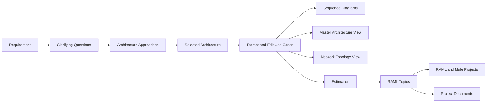

# MuleGenie

MuleGenie is a multi-agent application for designing MuleSoft integration solutions. It turns a business requirement into an architecture, editable use cases, diagrams, estimates, RAML specifications, Mule projects, and project documentation through a guided React interface.

## Features

- Classifies input as a general question or an architecture requirement.
- Asks focused clarification questions and presents architecture approaches.
- Generates a MuleSoft API-led architecture from the selected approach.
- Streams architecture and estimation responses into their respective tabs as they are generated.
- Extracts editable business use cases from the architecture.
- Generates draw.io diagrams:
  - One sequence diagram per use case
  - One master component/architecture diagram
  - One network topology diagram
- Generates project estimation from the architecture and approved use cases.
- Identifies APIs and generates RAML individually, with optional Excel field definitions.
- Downloads RAML bundles and generated Mule projects.
- Generates BRD, HLD, WBS, TDD, and Test Plan documents.
- Streams progress and errors to the UI through Socket.IO.
- Persists sessions and generated artifacts across browser refreshes.
- Tracks LLM token usage by agent and category.
- Supports multiple LLM providers with configured fallback clients.

## Workflow



Estimation is started explicitly from the Diagram tab after use cases have been extracted and reviewed. Documentation becomes available when architecture, estimation, and RAML topics exist; generating every RAML file is not required.

## Diagram Types

### Sequence diagram

Generated independently for each use case. It shows participants, lifelines, ordered requests, responses, and message direction.

### Master architecture diagram

A component-level view across all use cases. It shows Experience, Process, and System APIs together with connected enterprise systems.

### Network topology diagram

A network and deployment view organized into External, Security/Boundary, Internal Mule Runtime, and Backend/Enterprise zones. It shows trust boundaries, traffic direction, and known protocols. API policies are represented by one generic **Policy Enforcement Layer**, not by individual policy names.

Diagram prompts reuse a compact session context instead of repeatedly sending the full architecture response, reducing diagram-generation token usage.
Topology XML is normalized and validated before its draw.io URL is created, enforcing visible arrowheads, orthogonal routing, separated connection ports, protocol labels, and high-contrast connector styling.

## Technology

- Node.js, Express, and Socket.IO
- React 18
- Multi-agent A2A message routing
- draw.io XML diagram generation
- RAML and Mule project generation
- DOCX document export
- CSV-based token usage tracking

## Prerequisites

- Node.js 18 or newer
- npm
- An API key for at least one supported LLM provider

Supported providers:

- Anthropic
- Groq
- OpenAI
- Google Gemini
- OpenRouter

## Installation

Install backend and frontend dependencies:

```bash
npm install
cd client
npm install
cd ..
```

## Configuration

Create `.env` in the project root:

```env
# anthropic | groq | openai | gemini | openrouter
LLM_PROVIDER=anthropic

# Configure at least the selected provider.
ANTHROPIC_API_KEY=replace_with_your_key
ANTHROPIC_MODEL=claude-3-7-sonnet-20250219

# Optional fallback providers
GROQ_API_KEY=
GROQ_MODEL=openai/gpt-oss-120b

OPENAI_API_KEY=
OPENAI_MODEL=gpt-3.5-turbo

GEMINI_API_KEY=
GEMINI_MODEL=gemini-2.0-flash

OPENROUTER_API_KEY=
OPENROUTER_MODEL=meta-llama/llama-3.1-8b-instruct
OPENROUTER_BASE_URL=https://openrouter.ai/api/v1

# Runtime
BACKEND_HOST=localhost
BACKEND_PORT=5001
LLM_REQUEST_TIMEOUT_MS=420000
ESTIMATION_OVERALL_TIMEOUT_MS=420000

# Small, sufficiently detailed requirements can use the optimized path.
FAST_ARCHITECTURE_PATH=true
FAST_ARCHITECTURE_MAX_CHARS=1800

MAX_TOKENS=1000
TEMPERATURE=0.7
LOG_LEVEL=info
```

The committed `.env` file is a safe template. Put real API keys in `.env.local` or `.env.private`; those files are ignored by Git and override the template at runtime. Never commit or paste active credentials into source files, logs, issues, or documentation. If a key has been exposed, revoke and replace it.

### Application login

Configure the application login in `.env.local` or your hosting provider:

```env
APP_AUTH_USERNAME=your-username
APP_AUTH_PASSWORD=use-a-long-unique-password
APP_AUTH_SECRET=use-a-separate-long-random-secret
```

Authentication is enabled whenever `APP_AUTH_PASSWORD` is configured. Both `APP_AUTH_PASSWORD` and a separate `APP_AUTH_SECRET` are mandatory when `NODE_ENV=production`. Login uses a signed, HttpOnly cookie. Every generated session is owned by the signed-in identity, and REST and WebSocket access verify both ownership and the existing per-session token.

### Content Security Policy

The application sends CSP in report-only mode by default. Violations are summarized by the backend without logging page content. After validating the deployed application, enforce the policy with:

```env
CSP_REPORT_ONLY=false
```

If the browser must connect to an additional API or WebSocket host, add it to the comma-separated `CSP_CONNECT_SOURCES` setting.

### Encrypted storage and retention

Sessions persist across application restarts. In production they are stored using AES-256-GCM authenticated encryption. Configure a 32-byte key separately from the login secret:

```bash
openssl rand -base64 32
```

```env
DATA_ENCRYPTION_KEY=paste-the-generated-value
SESSION_RETENTION_DAYS=30
ARTIFACT_RETENTION_DAYS=30
```

`DATA_ENCRYPTION_KEY` is mandatory in production. Keep it stable across restarts; changing or losing it makes existing encrypted sessions unreadable. Expired sessions and generated files are cleaned at startup and every 24 hours. Token-usage CSV data is excluded from artifact cleanup.

### Automated security checks

GitHub Actions checks backend and frontend dependencies, scans committed files for common API keys and unsafe environment assignments, runs the security tests, and builds the frontend. Dependabot proposes weekly dependency updates for both Node projects.

Run the same scans locally:

```bash
npm run security:secrets
npm run security:audit
```

GitHub's repository-level secret scanning and push protection should also be enabled in repository settings when the hosting plan supports them.

### Optional frontend API URL

The development client proxies API requests to `http://localhost:5001`. To point a deployed client elsewhere, set:

```env
REACT_APP_API_BASE_URL=https://your-backend.example.com
```

### Optional MCP publishing

RAML publishing through an MCP server is optional:

```env
MCP_RAML_SERVER_URL=https://your-mcp-server.example.com
MCP_AUTH_TOKEN=
MCP_API_KEY=
MCP_CONNECTION_TIMEOUT_MS=15000
MCP_TOOL_TIMEOUT_MS=90000
```

## Running The Application

Start the backend and React development server together:

```bash
npm run dev
```

Then open:

- UI: `http://localhost:3000`
- Backend: `http://localhost:5001`

Run each service separately when debugging:

```bash
npm run server
npm run client
```

Build the frontend:

```bash
npm run build
```

### Production Single-App Deployment

For production, deploy this as one application. The Express server serves the built React UI from `client/build`, while `/api/*` and Socket.IO continue to run from the same backend process.

```bash
npm run start:prod
```

After deployment, use one public URL for everything:

```text
https://your-app.example.com
https://your-app.example.com/api/process
wss://your-app.example.com/socket.io
```

If your hosting platform runs build and start separately, run `npm run build:client` during the build step and `npm start` during the start step. Configure real secrets in `.env.local`, `.env.private`, or the hosting provider's environment variables.

## Using MuleGenie

1. Create or select a session.
2. Enter an integration requirement, such as a Salesforce-to-SAP synchronization.
3. Answer any clarification questions.
4. Review, edit, or add an architecture approach and select one.
5. Review the generated architecture.
6. Open the Diagram tab and extract use cases.
7. Edit use cases before generating diagrams or estimation.
8. Generate sequence diagrams, the Master Architecture view, or the Network Topology view as needed.
9. Click **Generate Estimation** after the use cases are ready.
10. Generate RAML for any identified API. RAML may be generated with or without uploaded field definitions.
11. Generate Mule code, download RAML ZIP files, or publish RAML when MCP is configured.
12. Generate available project documents and download them as formatted Word files.

Long-running operations use a seven-minute timeout by default. Errors are surfaced in the UI instead of leaving the job indefinitely in a running state.

## Project Structure

```text
.
├── client/                     React application
│   └── src/
│       ├── App.js              Session and workflow orchestration
│       └── components/         Output tabs, dialogs, and dashboards
├── server/
│   ├── index.js                Express, Socket.IO, sessions, and API routes
│   └── tokenUsageParser.js     Token dashboard data parsing
├── src/
│   ├── a2a/                    Agent registry, messages, and routing
│   ├── agent/                  Architecture, diagram, estimation, RAML,
│   │                           Mule code, documentation, and Q&A agents
│   ├── config/                 Provider and agent configuration
│   ├── documentation/          Document prompts and DOCX generation
│   ├── llm/                    LLM clients, fallback manager, and token tracking
│   ├── mule/                   Mule project download support
│   └── raml/                   RAML generation, download, and publishing
├── mcp/                        Optional MCP client integration
├── output/                     Generated outputs and token usage CSV
└── config/env.example          Basic environment template
```

## Session Data And Outputs

Session state is persisted locally in:

```text
output/.sessions/store.json
```

Generated examples and token usage data are written under `output/`. Do not commit session data if it contains customer requirements, architecture details, or generated proprietary content.

## Token Usage

The application records LLM usage in:

```text
output/llm_token_usage.csv
```

The UI token dashboard summarizes usage by date, provider, model, agent, category, and session. Diagram generation reduces repeated input tokens by caching a compact architecture context after use-case extraction and refreshing it whenever use cases are edited.

## Troubleshooting

### Missing API key

Confirm that `LLM_PROVIDER` matches a configured key in the root `.env`, then restart the backend.

### UI cannot reach the backend

Confirm that the backend is running on port `5001`. For a different backend URL, configure `REACT_APP_API_BASE_URL` and restart the React server.

### WebSocket reconnects

Check that proxies and load balancers allow WebSocket upgrades and use an idle timeout longer than the LLM request timeout.

### LLM timeout

Increase `LLM_REQUEST_TIMEOUT_MS` or `ESTIMATION_OVERALL_TIMEOUT_MS` if the selected provider regularly requires more than seven minutes. Large prompts may also require a model with a larger context window.

### Low balance or provider failure

Add another supported provider key for fallback or replenish the selected provider. Provider and job failures should appear in the application error dialog.

### Existing diagram does not reflect new rules

Regenerate the diagram. Stored draw.io URLs are not rewritten when diagram rules or prompts change.

## Security Notes

- Keep only the placeholder `.env` template in version control. Put real secrets in `.env.local`, `.env.private`, or hosting-provider environment variables.
- Revoke any API key that has been shared in chat, logs, or screenshots.
- Review generated architecture and code before using them in production.
- Treat generated RAML, documents, and session data as potentially sensitive.
- Restrict access to MCP publishing endpoints and use authentication.
- IP-based rate limits are implemented in `server/rateLimiter.js` and wired into LLM, generation, download, and read routes. Tune them with `RATE_LIMIT_*` environment variables, or replace that module later with Redis/user-based limits.

## License

MIT
